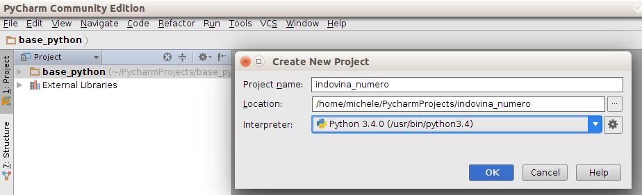
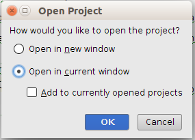
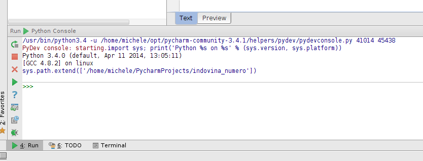
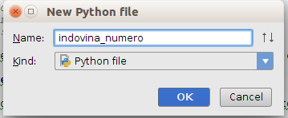
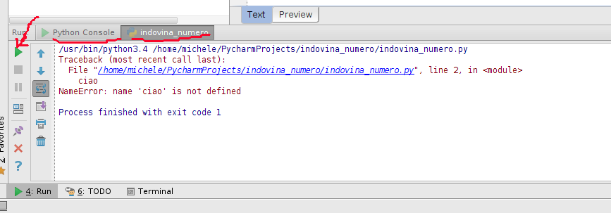

# Primi passi

Nei primi passi faremo le seguenti cose:

1. Creiamo un nuovo progetto in *PyCharm*
2. Apriamo la console per parlare direttamente con *Python*
3. Creiamo il programma vuoto e lo eseguiamo

## Nuovo Progetto

Un progetto è un contenitore dove si mettono tutte le cose relative al programma che si vuole scrivere. Nel progetto
oltre ai files dove ci sono scritti i programmi possiamo avere immagini, suoni, files che contengono dati e altro 
ancora. Quindi tutte le volte che iniziamo un nuovo lavoro ci preoccuperemo di creare il progetto che sarà il grande
scatolone dove metteremo tutto quello che ci serve.
 
* Se non lo avete ancora fatto aprite *PyCharm* dovre l'icona dovrebbe assomigliare a 

* Cliccate sul menù *File* -> *New Project* e chiamatelo `indovina_numero` scegliendo *Python3.4...* nella tendina
"Interpreter". Ditegli di usare la finestra corrente.
 
 

## Console

Per eseguire un programma si dice a *Python* di leggere un file dove ci sono tutte le informazioni e le righe da
eseguire per fare tutto quello che deve fare. E' possibile anche parlare direttamente con *Python* e scrivere le
righe direttamente, in questo modo si può provare ogni cosa prima di scriverla nel programma.

Il posto dove parlare direttamente con *Python* si chiama *Python Console* ed è il posto migliore dove provare sia le
singole istruzioni che anche cose più complesse.

Apriamo quindi la console usando il menu *Tools* -> *Run Python Console...*. Nella parte bassa di *PyCharm* si aprirà 
la console dove inizieremo a scrivere.

Proviamo a salutare la console scrivendo `ciao` e andando a capo... Non sembra prenderla bene e risponde in rosso

    >>> ciao
    Traceback (most recent call last):
      File "/usr/lib/python3.4/code.py", line 90, in runcode
        exec(code, self.locals)
      File "<input>", line 1, in <module>
    NameError: name 'ciao' is not defined

Dopo riproveremo a farci capire, ma per ora siamo contenti dato che sembra che riusciamo a comunicare con *Python*.

## Dove scriveremo il programma

Iniziamo a creare un file vuoto e a eseguire un programma vuoto.

Dopo avere selezionato la cartella **`indovina_numero`** premete il tasto destro e selezionate *New*->*Python File*.
Chiamate anche questo file `indovina_numero` e verificate che sia di tipo *Python File* come nell'immagine

Il vostro file ora dovrebbe contenere una riga del tipo

    __author__ = 'michele'
    
Sono informazioni che *PyCharm* mette in automatico; in questo momento possiamo ignorare questa riga o cancellarla.

Questo programma vuoto può essere eseguito e lo facciamo... Selezionate `indovina_numero.py` e premete il tasto destro
per eseguire *Run `indovina_numero.py`* (alternativamente potete usate il menù *Run* in alto).

Se volete essere sicuri andate nel file `indovina_numero.py` e scrivete `ciao`: eseguendolo avrete ancora lo stesso 
errore che avete visto sulla console:

    /usr/bin/python3.4 /home/michele/PycharmProjects/indovina_numero/indovina_numero.py
    Traceback (most recent call last):
      File "/home/michele/PycharmProjects/indovina_numero/indovina_numero.py", line 2, in <module>
        ciao
    NameError: name 'ciao' is not defined
    
    Process finished with exit code 1

Quando volete rieseguire il programma potete usare la freccetta verde nella finestra di *Run*. Notate anche che 
avete una finestrella per il vostro programma `indovina_numero` e una per la *Python Console*.

* Prossimo: [Leggere e Scrivere](leggere_scrivere.md) 
* Precedente: [Indovina Numero](indovina_numero.md) 
